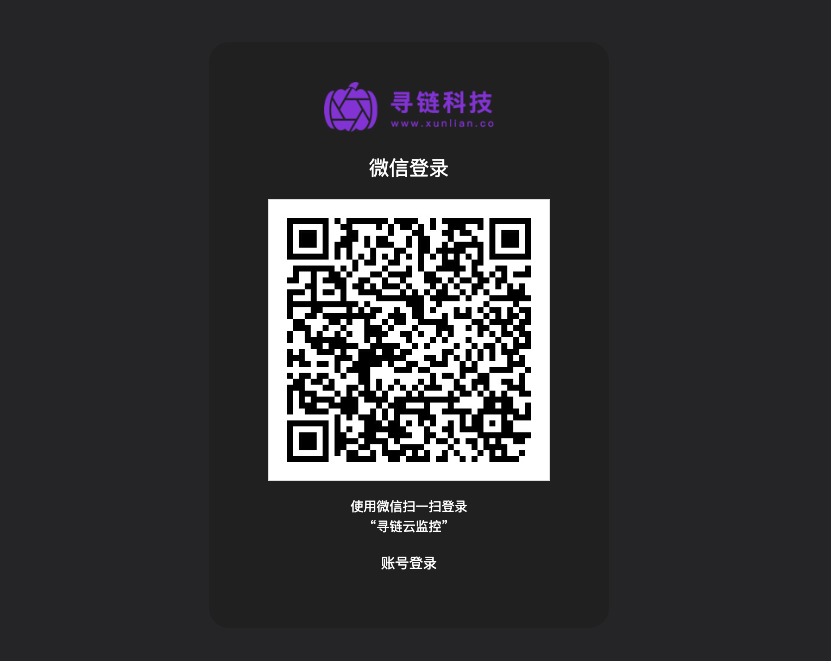

# 开始接入

## 1.打开寻链云监控网址：[https://monitor.xunlian.co/](https://monitor-magua.xunlian.co/)

## 2.注册登录。目前支持微信扫码注册和登录，登录后可绑定手机号和设置登录密码，绑定手机号后并设置登录密码后也可通过手机号密码登录。

<figure><figcaption></figcaption></figure>

## 3.打开设备菜单，点击添加设备，复制监控安装命令。

<div data-full-width="false">

<figure><figcaption></figcaption></figure>

</div>

## 4.进入设备操作系统，切换到root账号，如何切换到root账号？命令：

```bash
bash <(curl https://monitor.xunlian.co/api/install/每个人不一样)
```

## 5.粘贴命令执行。看到如下结果即为安装成功。

安装成功截图？

安装失败截图？

常见安装失败的原因。

PS：内测阶段一个账号限制安装5台设备。如需安装更多设备，请[联系我们](qa/contactus.md)。

